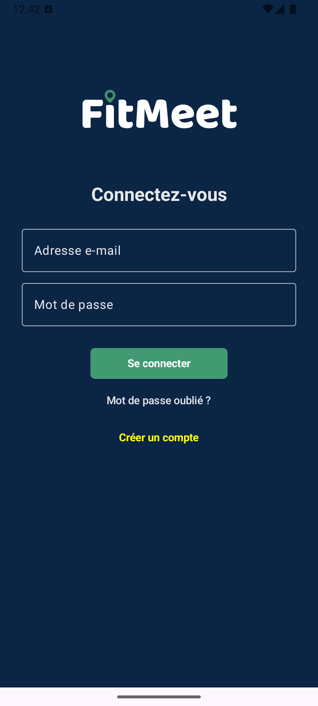
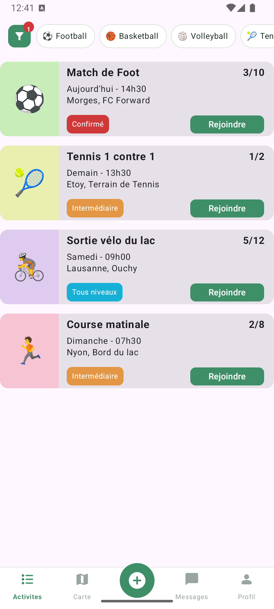
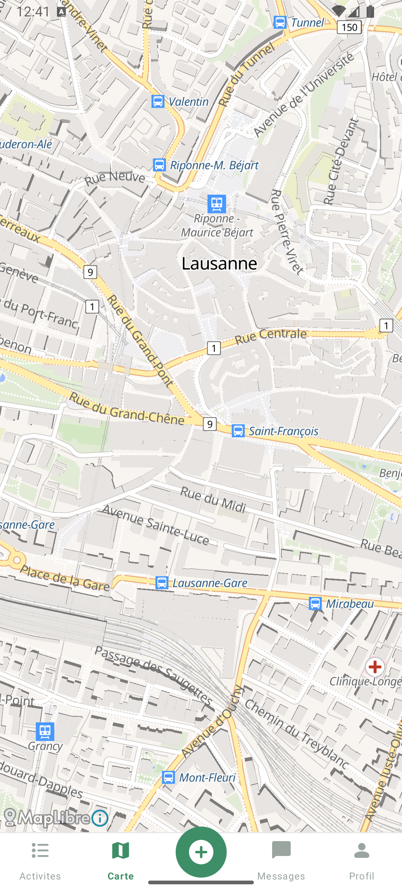
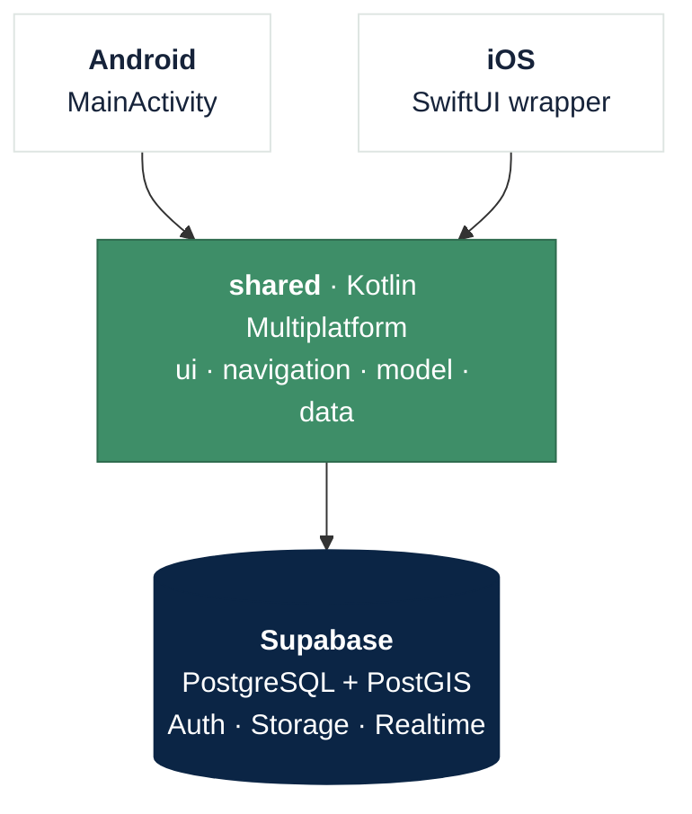

<div align="center">


### Meet people, Fit together

FitMeet matches sport sessions, not profiles. A sport, a place, a time, a
level — you create one, or you join one.

<a href="https://mircoprofico.github.io/FitMeet/">Landing page</a> ·
<a href="https://github.com/mircoprofico/FitMeet/issues">Issues</a> ·
<a href="https://github.com/users/mircoprofico/projects/2">Board</a>

<br>


</div>

---

<div align="center">



</div>

---

## Features

- Accounts for individuals and clubs, with a sport-level onboarding
- Create an activity: sport, date, duration, map location, level, capacity, price
- Browse as a list or on a map, from the same data
- Filter by sport, date and remaining spots, sorted by distance
- Join and leave, with capacity enforced in the database
- Group chat per activity

## Architecture



One Kotlin codebase covers both platforms, user interface included. Only map
rendering and location services are platform-specific, behind `expect` /
`actual`.

| Layer | Choice |
|---|---|
| Application | Kotlin Multiplatform 2.4.10, Compose Multiplatform 1.11.1 |
| Design system | Material 3 |
| Navigation | Navigation Compose 2.9.2, type-safe routes |
| Backend | Supabase 3.7.0 — PostgreSQL, Auth, Storage, Realtime |
| Geography | PostGIS |
| Maps | MapLibre 11, OpenStreetMap tiles |
| Delivery | GitHub Actions |

Rules that must not be bypassed live in the database: `join_event` locks the
event row and counts participants in the same transaction, so two people cannot
both take the last spot.

---

## Getting started

Requires Android Studio, JDK 21, a Supabase project, and Xcode 15+ for iOS.

```bash
git clone git@github.com:mircoprofico/FitMeet.git
cd FitMeet
cp local.properties.example local.properties
```

Fill in `local.properties` from the Supabase dashboard (**Connect**), or ask a
maintainer:

```properties
SUPABASE_URL=https://your-project-ref.supabase.co
SUPABASE_PUBLISHABLE_KEY=sb_publishable_your_key_here
```

```bash
./gradlew :androidApp:installDebug                       # Android
./gradlew :shared:linkDebugFrameworkIosSimulatorArm64    # iOS, then open iosApp/iosApp.xcodeproj
supabase db push                                         # schema, 19 migrations
./gradlew :shared:allTests                               # tests
```

`supabase/seed_demo_data.sql` fills a fresh project with demo accounts and
activities.

---

## Ship a change

Pipeline: [`.github/workflows/ci-cd.yml`](.github/workflows/ci-cd.yml). It runs
on every pull request and on every merge into `main` or `staging`.

```bash
git checkout <issue-number>-<slug>     # branch from the issue on GitHub
git commit -m "Describe the change"
git push -u origin <branch>
gh pr create --base staging
gh pr checks <number> --watch          # Android + iOS must pass
gh pr merge <number> --merge
```

Merging into `main` publishes a GitHub release with the APK attached. `staging`
needs no approval, `main` needs one review.

## Contributing

GitHub Flow: one branch per issue, one pull request, one review.

- Start from an issue, branch from `staging`, never from `main`.
- Code in English, user-facing text in French.
- One screen per file; give every component a `@Preview`.
- Before opening a PR: merge `staging`, build, run the tests.

Both branches are protected — no force push, no deletion, checks required.

---

## Project layout

```
androidApp/                     Android entry point
iosApp/                         iOS entry point, SwiftUI wrapper
shared/src/
  commonMain/kotlin/            data · model · navigation · ui
  commonMain/composeResources/  icons and images
  androidMain/ iosMain/         map and location
  commonTest/                   tests, both platforms
supabase/migrations/            database schema
landingPage/                    public page, GitHub Pages
docs/                           architecture, user stories, process
```

---

## Contributors

<table>
  <tr>
    <td align="center" width="25%">
      <a href="https://github.com/mircoprofico">
        <br>
        <sub><b>mircoprofico</b></sub>
      </a><br>
      <sub>Activity list and detail<br>Design system · CI/CD</sub>
    </td>
    <td align="center" width="25%">
      <a href="https://github.com/calystoxi">
        <br>
        <sub><b>calystoxi</b></sub>
      </a><br>
      <sub>Map and location<br>User profile</sub>
    </td>
    <td align="center" width="25%">
      <a href="https://github.com/IbuprofenLover">
        <br>
        <sub><b>IbuprofenLover</b></sub>
      </a><br>
      <sub>Activity creation<br>Messaging · tests</sub>
    </td>
    <td align="center" width="25%">
      <a href="https://github.com/fr2c">
        <br>
        <sub><b>fr2c</b></sub>
      </a><br>
      <sub>Authentication<br>Database · onboarding</sub>
    </td>
  </tr>
</table>

Four students at HEIG-VD.

## Documentation

| | |
|---|---|
| [Project description](docs/projectDescription.md) | Goals, requirements |
| [User stories](docs/UserStories.md) | Scenarios and acceptance criteria |
| [Development process](docs/processus-de-developpement.md) | Board, Git workflow, definition of done |

## Credits

[Material Symbols](https://fonts.google.com/icons) and
[Noto Emoji](https://github.com/googlefonts/noto-emoji) (Apache 2.0). Map data
© OpenStreetMap contributors, rendered with [MapLibre](https://maplibre.org).
